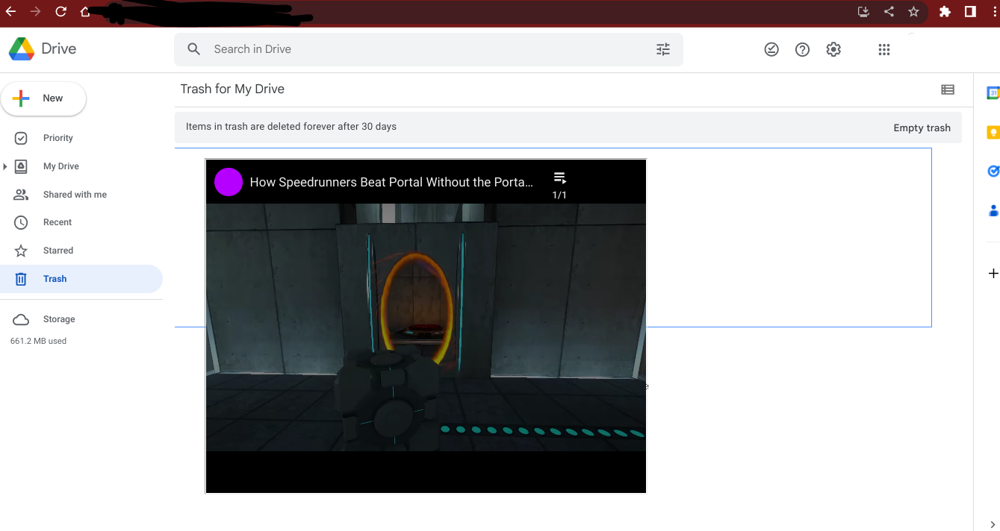
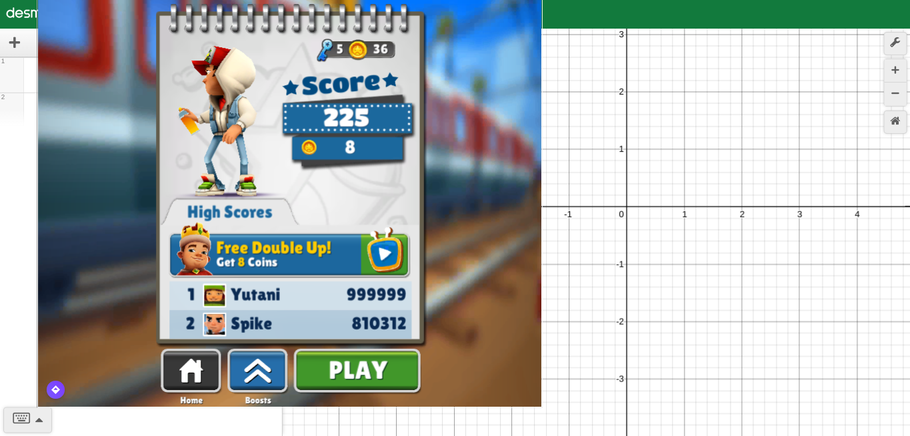

# YT8-H
## It puts a movable youtube embed/iframe on any page.
It uses yout-ube so there are no ads, It also hides the iframe when the mouse is off of the iframe.
Please note: This will not work on age restricted videos(like all embeds), It also won't work one some sites(Prob becuase of stricter cors policies)

## It works with a ton of other sites too!
Put another site url into the prmpot and it will make a iframe of that site!

## You can get it [here](https://raw.githubusercontent.com/YT8-H/YT8-H/main/YT8-H.js). (Ctrl+A, Ctrl+C, Add it as a bookmark, name it whatever you want).
# Keybinds

**-** Decrease size    

**+** Increase size (It is actually the = sign but just ignore that)  

**Q** Kill Iframe    

**G** Show Iframe    

**(TBA)C:** Change Video    

**M** Hide Iframe    

**Arrow Key:** Move Iframe    

